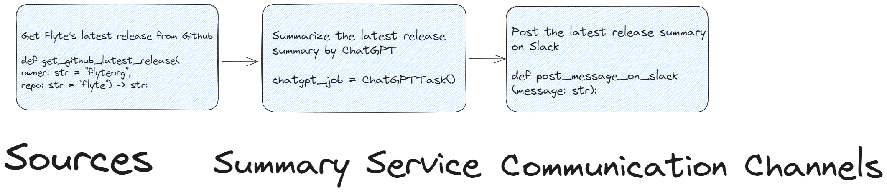
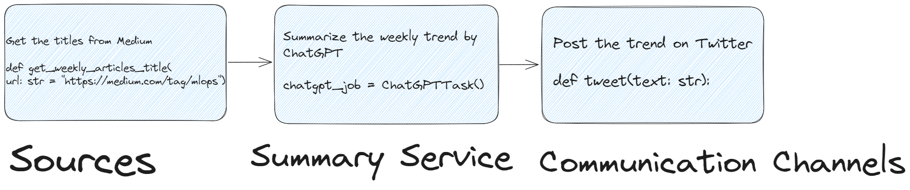
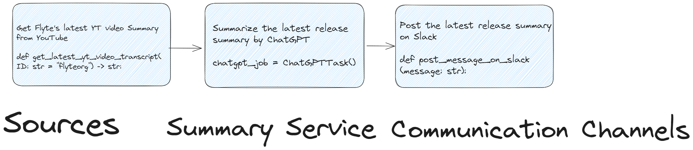
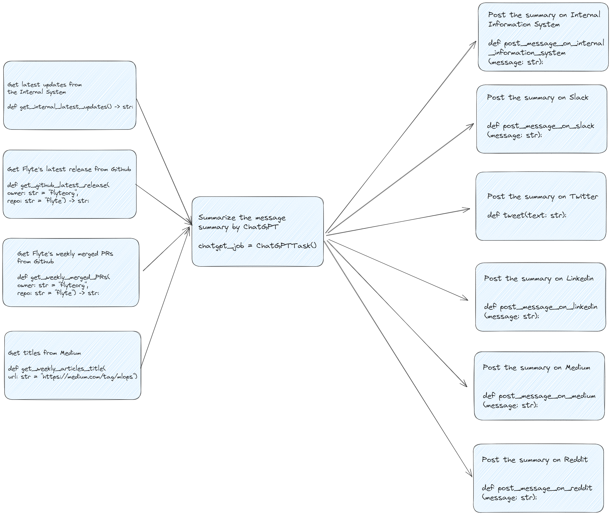
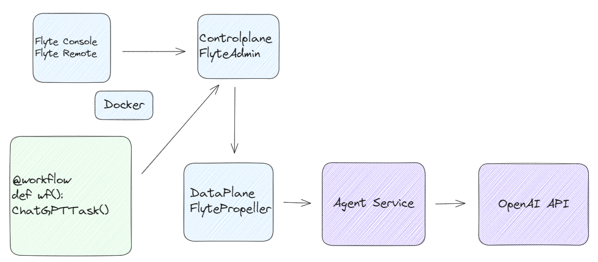
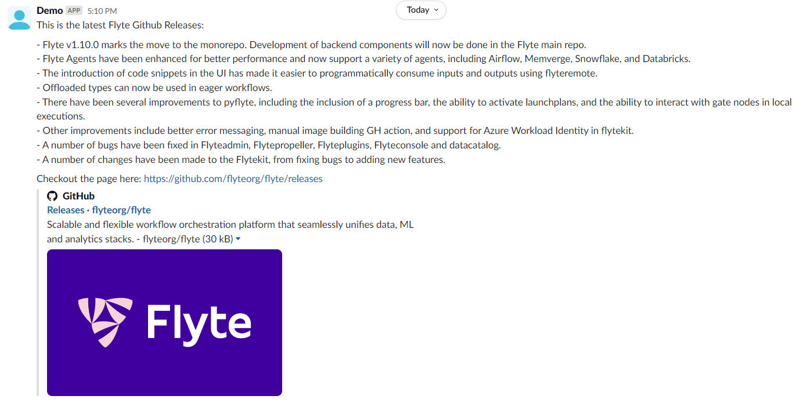
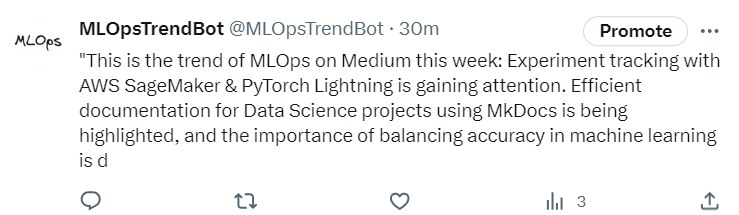
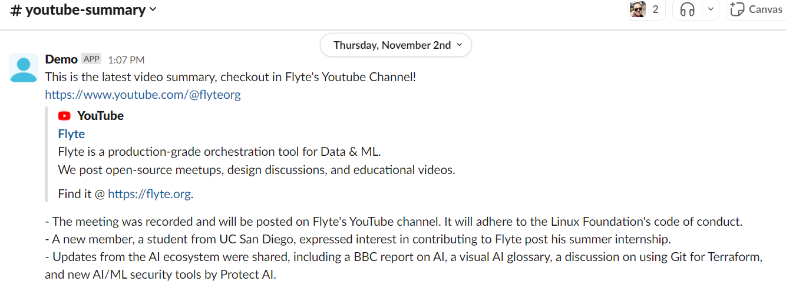
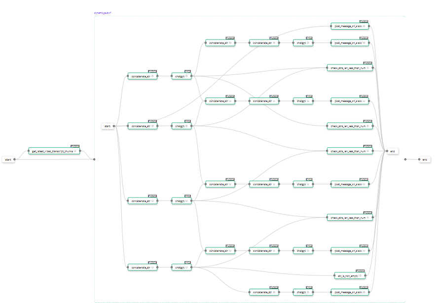

# FlyteChatGPTSummaryBot

## Demo
<table>
  <tr>
    <td>
      <!-- github_release_bot GIF -->
      
    </td>
    <td>
      <!-- MLOPs_medium_bot GIF -->
      
    </td>
    <!-- YT_video_release_bot video cell -->
    <td>
      <!-- YT_video_release_bot video -->
      
    </td>
  </tr>
  <tr>
    <td>
      <!-- github_release_bot caption -->
      <a href="https://join.slack.com/t/flytechatgptp-gqx8571/shared_invite/zt-25okk0gyc-HUKChk1LVDN5QsdNNT3xsA">Flyte GitHub Release Slack Bot</a>
    </td>
    <td>
      <!-- MLOPs_medium_bot caption -->
      <a href="https://twitter.com/MLOpsTrendBot">MLOPs Medium Tweet Bot</a>
    </td>
    <!-- YT_video_release_bot caption cell -->
    <td>
      <!-- YT_video_release_bot caption -->
      <a href="https://join.slack.com/t/flytechatgptp-gqx8571/shared_invite/zt-25okk0gyc-HUKChk1LVDN5QsdNNT3xsA">YT Video Release Bot</a>
    </td>
  </tr>
</table>

## Motivation
In this era, lots of information explodes, such as videos, articles, or github releases.
Summarizing these information becomes a necessity to us, since we don't have to time to absorb these information one by one.

Enter **FlyteChatGPTSummaryBot**: 
Leveraging the system architecture of **Sources**, **Summary Service**, and **Communication Channels**, it offers a solution to summarize information and send it to your customized notifictioans.

I provide 3 examples in this repo.

- Summarize the latest MLOps trends weekly in Medium and send them to Twitter.
- Summarize the latest `flyteorg/flyte` repo releases, and send it to Slack Channel.
- Summarize the latest `flyteorg` youtube video, and send it to Slack Channel.

The essence of **FlyteChatGPTSummaryBot** reduce the burden of consuming lots of information, and its utility extends to lots of scenarios.
Also, it leverages Flyte's capability, which makes workflows reproducible and have Versioned feature!


## How it works
### Overview of the `GithubLatestRelease` Workflow

### Overview of the `MediumWeeklyMLOpsTrend` Workflow

### Overview of the  `YoutubeLatestSummary` Workflow


### Multiple workflow usecases

- Sources: Internal System, Github Weekly Merged PRs, Github Latest Release, Medium MLOps Weekly Title, HackerNews
- Summary Service: ChatGPT
- Communication Channels: Internal Information System, Slack, Twitter, Linkedin, Medium, Reddit
### ChatGPT Task Architecture Diagram


## Other Use cases
### Corporate News Digest
Companies frequently release weekly and daily updates.

Using this technology, we can automate the process of summarizing these updates, providing employees and stakeholders with concise digests of essential information.

### Event Recaps
After major industry events or conferences, there's often an influx of articles, interviews, and reports.

This system can generate quick recaps, allowing interested parts to stay updated without spending hours reading.

### Product Updates
For tech companies releasing frequent product updates and patches, our solution can summarize the changelogs and release notes, making it easier for users to understand the latest changes.

### Social Media Monitoring
Brands can utilize this tool to summarize customer feedback and reviews from various platforms, helping them gain insights into customer sentiments more efficiently

## How to setup
### 1.Start your flyte cluster.
```bash
flytectl demo start
```
This step will start your flyte cluster and agent server.
The agent server will handle the ChatGPT Task to OpenAI server.
### 2.Add the OpenAI access token
Set the secret I write in `demo` section.

```bash
kubectl edit secret flyteagent -n flyte
```
```yaml
apiVersion: v1
data:
  flyte_openai_access_token: <BASE64_ENCODED_OPENAI_TOKEN>
  username: User
```
```bash
kubectl rollout restart deployment flyteagent  -n flyte
```

## How to execute

### Get the Latest Flyte Release Summary (Reduced 10+ times characters, From 13410 characters to 1108 characters.)
Post the latest Flyte release's summary on this [Slack Channel](https://join.slack.com/t/flytechatgptp-gqx8571/shared_invite/zt-25okk0gyc-HUKChk1LVDN5QsdNNT3xsA)!

Execute it locally by `python`

Create the secret locally
```bash
cd /etc/secrets
mkdir slack-api
echo "SLACK_API_TOKEN" > token
```
```bash
python getFlyteLatestReleaseSummary.py
```
Or execute it remotley by `pyflyte run --remote`
```bash
kubectl create secret generic slack-api\
      --from-literal=token="SLACK_API_TOKEN"\
      -n flytesnacks-development
kubectl create secret generic github-api\
      --from-literal=token="GITHUB_API_TOKEN"\
      -n flytesnacks-development
```
```bash
pyflyte run --remote --image futureoutlier/flytekit:chatgpt getFlyteLatestReleaseSummary.py wf
```

Screenshot



### Get Medium Weekly MLOps Trend
Get the MLOps latest news from Medium and summarize it to [this Twitter Account](https://twitter.com/MLOpsTrendBot)!

Execute it by `python`

Create the secret locally
```bash
cd /etc/secrets
mkdir tweet-api
echo "bearer_token" > bearer_token
echo "consumer_key" > consumer_key
echo "consumer_secret" > consumer_secret
echo "access_token" > access_token
echo "access_token_secret" > access_token_secret
```
```bash
python getWeeklyMLOpsTrend.py
```
Or execute it remotley by `pyflyte run --remote`
```bash
kubectl create secret generic tweet-api\
      --from-literal=bearer_token="bearer_token"\
      --from-literal=consumer_key="consumer_key"\
      --from-literal=consumer_secret="consumer_secret"\
      --from-literal=access_token="access_token"\
      --from-literal=access_token_secret="access_token_secret"\
      -n flytesnacks-development
```
```bash
pyflyte run --remote --image futureoutlier/flytekit:chatgpt-v2 getWeeklyMLOpsTrend.py wf --url "https://medium.com/tag/mlops"
```

Screenshot



### Get the Latest Flyte Youtube Summary (Reduced a 45 minutes video to 6 minutes Reading Time Article)
Post the latest Flyte Youtube Summary on this [Slack Channel](https://join.slack.com/t/flytechatgptp-gqx8571/shared_invite/zt-25okk0gyc-HUKChk1LVDN5QsdNNT3xsA)!

Execute it locally by `python`

Create the secret locally
```bash
cd /etc/secrets
mkdir slack-api
echo "SLACK_API_TOKEN" > token
```
```bash
python getFlyteLatestReleaseSummary.py
```
Or execute it remotley by `pyflyte run --remote`
```bash
kubectl create secret generic slack-api\
      --from-literal=token="SLACK_API_TOKEN"\
      -n flytesnacks-development
```
```bash
pyflyte run --remote futureoutlier/flytekit:chatgpt your-image getFlyteLatestYouTubeSummary.py.py wf
```

Screenshot


