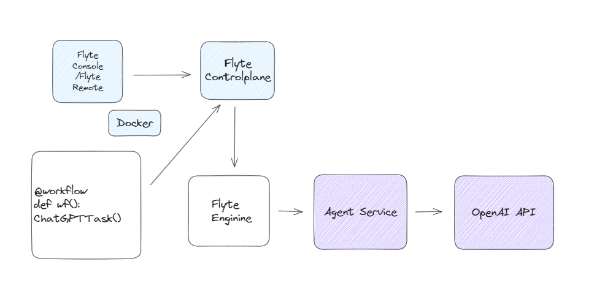

# MLOpsTrendFlyteBot
## Demo
Get the MLOps latest news from Medium and summarize it to [this Twitter Account](https://twitter.com/MLOpsTrendBot)!

https://github.com/Future-Outlier/MLOpsTrendFlyteBot/assets/76461262/ca79a0a0-2ac8-4d65-b22f-0a48506dca2d

Execute it by `python`
```bash
python getWeeklyMLOpsTrend.py
```
Or execute it by `pyflyte run --remote`
```bash
pyflyte run --remote --image your-image getWeeklyMLOpsTrend.py wf --url "https://medium.com/tag/mlops"
```


## Motivation
There's a lot more online content now, and it's hard to absorb all the information.
This is a big challenge in areas like MLOps, where staying updated on the newest trends,
tools, and ways of doing things is really time-consuming.

MLOpsTrendFlyteBot is a tool that uses ChatGPT to find, shorten, and share the newest and most important MLOps news from Medium. It uses Flyte’s machine learning workflows to automate this, making sure users get clear and complete updates directly, like in their Twitter feeds.

## How it works
### Overview of the Workflow

### Architecture Diagram


### Web Scraping Medium Articles
We utilize web scraping techniques to extract articles from [medium MLOps](https://medium.com/tag/mlops).
The goal is to gather relevant and latest content about MLOps from a trusted source.

### Summarization with ChatGPT (GPT-4 Model)
The extracted texts from Medium are fed into the ChatGPT model with GPT-4 architecture.
The model generates a concise summary of the articles, ensuring the essence of the content is retained.

### Tweeting the Summaries
The summarized content is then posted on Twitter, allowing followers to get quick insights into the latest MLOps articles without having to read the entire piece.

## How to setup
### 1.Start your flyte cluster.
```bash
flytectl demo start
```
This step will start your flyte cluster and agent server.
The agent server will handle the ChatGPT Task to OpenAI server.
### 2.Set the secret value
```bash
kubectl edit secret flyte-sandbox-config-secret -n flyte
```
```yaml
apiVersion: v1
data:
  012-database-secrets.yaml: ZGF0YWJhc2U6CiAgcG9zdGdyZXM6CiAgICBwYXNzd29yZDogInBvc3RncmVzIgo=
  013-storage-secrets.yaml: c3RvcmFnZToKICBzdG93OgogICAgY29uZmlnOgogICAgICBhY2Nlc3Nfa2V5X2lkOiAibWluaW8iCiAgICAgIHNlY3JldF9rZXk6ICJtaW5pb3N0b3JhZ2UiCg==
  bearer_token: <BASE64_ENCODED_TWITTER_BEARER_TOKEN>
  consumer_key: <BASE64_ENCODED_TWITTER_CONSUMER_KEY>
  consumer_secret: <BASE64_ENCODED_TWITTER_CONSUMER_SECRET>
  access_token: <BASE64_ENCODED_TWITTER_ACCESS_TOKEN>
  access_token_secret: <BASE64_ENCODED_TWITTER_ACCESS_TOKEN_SECRET>
```
### 3.Enable the ChatGPT agent on the demo cluster by adding the following config
```bash
kubectl edit configmap flyte-sandbox-config -n flyte
```
```yaml
tasks:
  task-plugins:
    default-for-task-types:
      container: container
      container_array: k8s-array
      sidecar: sidecar
      api_task: agent-service
    enabled-plugins:
      - container
      - sidecar
      - k8s-array
      - agent-service
plugins:
  agent-service:
    supportedTaskTypes:
        - api_task
```
```bash
kubectl rollout restart deployment flyte-sandbox -n flyte
```
4.Add the OpenAI access token
```bash
kubectl edit secret flyteagent -n flyte
```
```yaml
apiVersion: v1
data:
  flyte_openai_access_token: <BASE64_ENCODED_OPENAI_TOKEN>
  username: User
```
```bash
kubectl rollout restart deployment flyteagent  -n flyte
```

## Other Use cases
In most of companies, they will update lots of weekly news and daily news, which is a lot of information.
We can use every notifications as a workflow to simplify the process of summarizing the information.

