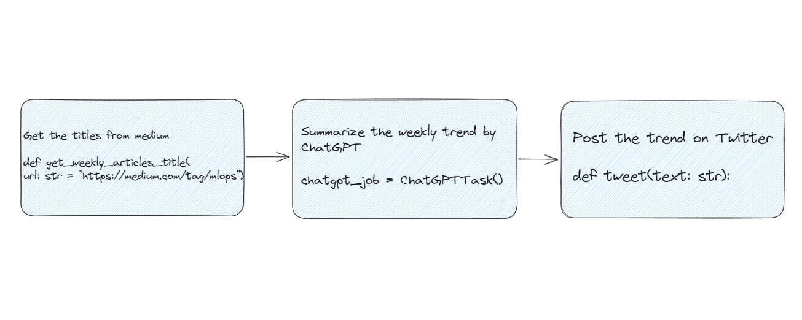

# MLOpsTrendFlyteBot
## Demo
Get the MLOps latest news from Medium and summarize it to [this Twitter Account](https://twitter.com/MLOpsTrendBot)!

https://github.com/Future-Outlier/MLOpsTrendFlyteBot/assets/76461262/ca79a0a0-2ac8-4d65-b22f-0a48506dca2d

Execute it by `python`
```bash
python getWeeklyMLOpsTrend.py
```
Or execute it by `pyflyte run --remote`
```bash
pyflyte run --remote --image your-image getWeeklyMLOpsTrend.py wf --url "https://medium.com/tag/mlops"
```


## Motivation
In today's digital era, the sheer volume of online content has grown exponentially, making it a challenge for individuals to sift through and stay updated. This is especially true in specialized domains like MLOps, where the rapid evolution of trends, tools, and methodologies demands constant vigilance.

MLOpsTrendFlyteBot is a new tool that helps with this problem. It uses ChatGPT to find the newest and most important MLOps news articles on Medium. Then, it shortens these articles and shares the key information. It uses Flyte's machine learning workflows to do this automatically. This way, users get clear and complete updates right in their Twitter feed.

MLOpsTrendFlyteBot could also be helpful in many other situations:

- For companies - It could take long weekly updates and summarize them into shorter versions. This would help employees stay informed.
- After big events - There are usually many long articles and reports afterward. The tool could make short recaps so people can catch up fast.
- For tech products - When new software versions come out, the changes can be hard to understand. Summaries of the updates would help users.
- For brands - They could use it to sort through customer feedback from different sites. This would help them understand how people feel about their products.

The main idea behind MLOpsTrendFlyteBot is useful in lots of places.
The tool can be used in many ways, helping people handle lots of information.

## How it works
### Overview of the Workflow

### Architecture Diagram


### Web Scraping Medium Articles
We utilize web scraping techniques to extract articles from [medium MLOps](https://medium.com/tag/mlops).
The goal is to gather relevant and latest content about MLOps from a trusted source.

### Summarization with ChatGPT (GPT-4 Model)
The extracted texts from Medium are fed into the ChatGPT model with GPT-4 architecture.
The model generates a concise summary of the articles, ensuring the essence of the content is retained.

### Tweeting the Summaries
The summarized content is then posted on Twitter, allowing followers to get quick insights into the latest MLOps articles without having to read the entire piece.

## How to setup
### 1.Start your flyte cluster.
```bash
flytectl demo start
```
This step will start your flyte cluster and agent server.
The agent server will handle the ChatGPT Task to OpenAI server.
### 2.Set the secret value
```bash
kubectl edit secret flyte-sandbox-config-secret -n flyte
```
```yaml
apiVersion: v1
data:
  012-database-secrets.yaml: ZGF0YWJhc2U6CiAgcG9zdGdyZXM6CiAgICBwYXNzd29yZDogInBvc3RncmVzIgo=
  013-storage-secrets.yaml: c3RvcmFnZToKICBzdG93OgogICAgY29uZmlnOgogICAgICBhY2Nlc3Nfa2V5X2lkOiAibWluaW8iCiAgICAgIHNlY3JldF9rZXk6ICJtaW5pb3N0b3JhZ2UiCg==
  bearer_token: <BASE64_ENCODED_TWITTER_BEARER_TOKEN>
  consumer_key: <BASE64_ENCODED_TWITTER_CONSUMER_KEY>
  consumer_secret: <BASE64_ENCODED_TWITTER_CONSUMER_SECRET>
  access_token: <BASE64_ENCODED_TWITTER_ACCESS_TOKEN>
  access_token_secret: <BASE64_ENCODED_TWITTER_ACCESS_TOKEN_SECRET>
```
### 3.Enable the ChatGPT agent on the demo cluster by adding the following config
```bash
kubectl edit configmap flyte-sandbox-config -n flyte
```
```yaml
tasks:
  task-plugins:
    default-for-task-types:
      container: container
      container_array: k8s-array
      sidecar: sidecar
      api_task: agent-service
    enabled-plugins:
      - container
      - sidecar
      - k8s-array
      - agent-service
plugins:
  agent-service:
    supportedTaskTypes:
        - api_task
```
```bash
kubectl rollout restart deployment flyte-sandbox -n flyte
```
### 4.Add the OpenAI access token
```bash
kubectl edit secret flyteagent -n flyte
```
```yaml
apiVersion: v1
data:
  flyte_openai_access_token: <BASE64_ENCODED_OPENAI_TOKEN>
  username: User
```
```bash
kubectl rollout restart deployment flyteagent  -n flyte
```

## Other Use cases
### Corporate News Digest
Companies frequently release weekly and daily updates. Using this technology, we can automate the process of summarizing these updates, providing employees and stakeholders with concise digests of essential information.

### Event Recaps
After major industry events or conferences, there's often an influx of articles, interviews, and reports.
This system can generate quick recaps, allowing interested parts to stay updated without spending hours reading.

### Product Updates
For tech companies releasing frequent product updates and patches, our solution can summarize the changelogs and release notes, making it easier for users to understand the latest changes.

### Social Media Monitoring
Brands can utilize this tool to summarize customer feedback and reviews from various platforms, helping them gain insights into customer sentiments more efficiently
