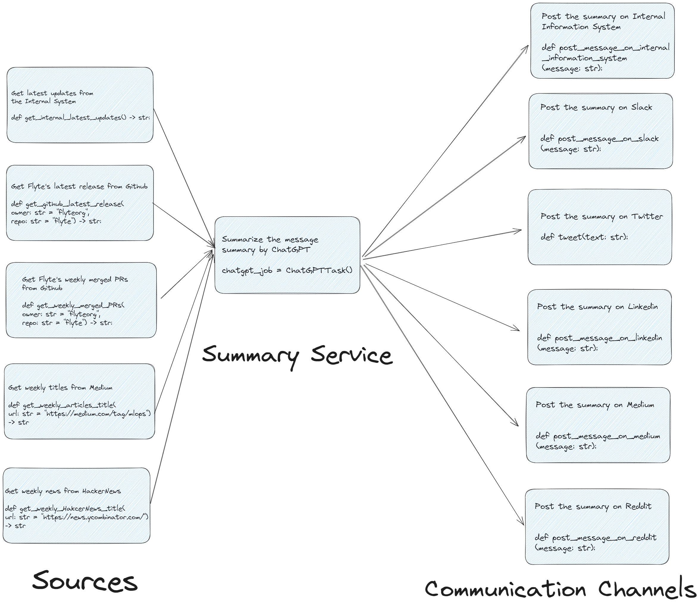
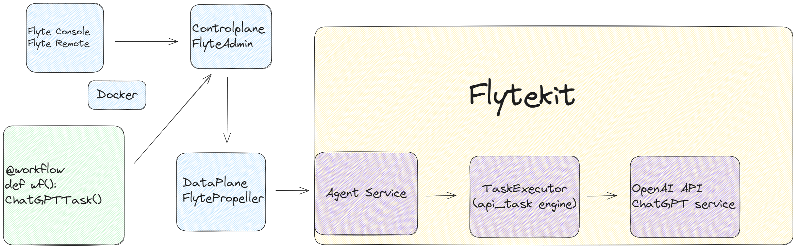

# FlyteChatGPTSummaryBot

## Demo
<table>
  <tr>
    <td>
      <!-- github_release_bot GIF -->
      
    </td>
    <td>
      <!-- MLOPs_medium_bot GIF -->
      
    </td>
  </tr>
  <tr>
    <td>
      <!-- github_release_bot caption -->
      Flyte GitHub Release Slack Bot
    </td>
    <td>
      <!-- MLOPs_medium_bot caption -->
      MLOPs Medium Tweet Bot
    </td>
  </tr>
</table>


### Get the Latest Flyte Release Summary (Reduced 10+ times characters, From 13410 characters to 1108 characters.)
Execute it locally by `python`

Create the secret locally
```bash
cd /etc/secrets
mkdir slack-api
echo "SLACK_API_TOKEN" > token
```
```bash
python getFlyteLatestReleaseSummary.py
```
Or execute it remotley by `pyflyte run --remote`
```bash
kubectl create secret generic slack-api\
      --from-literal=token="SLACK_API_TOKEN"
```
```bash
pyflyte run --remote --image your-image getFlyteLatestReleaseSummary.py wf
```

Screenshot


### Get Weekly MLOps Trend
Get the MLOps latest news from Medium and summarize it to [this Twitter Account](https://twitter.com/MLOpsTrendBot)!

Execute it by `python`

Create the secret locally
```bash
cd /etc/secrets
mkdir tweet-api
echo "bearer_token" > bearer_token
echo "consumer_key" > consumer_key
echo "consumer_secret" > consumer_secret
echo "access_token" > access_token
echo "access_token_secret" > access_token_secret
```
```bash
python getWeeklyMLOpsTrend.py
```
Or execute it remotley by `pyflyte run --remote`
```bash
kubectl create secret generic tweet-api\
      --from-literal=bearer_token="bearer_token"\
      --from-literal=consumer_key="consumer_key"\
      --from-literal=consumer_secret="consumer_secret"\
      --from-literal=access_token="access_token"\
      --from-literal=access_token_secret="access_token_secret"
```
```bash
pyflyte run --remote --image your-image getWeeklyMLOpsTrend.py wf --url "https://medium.com/tag/mlops"
```

Screenshot


## Motivation
In the vast digital landscape of our age, the flood of online content is overwhelming, posing a challenge for many to digest and keep up-to-date.
This holds true, especially in niche fields such as MLOps, where rapid shifts in trends, tools, and practices necessitate continuous attention.

Enter **FlyteChatGPTSummaryBot**. This tool is designed to tackle the information deluge. Harnessing the power of ChatGPT, it identifies fresh and crucial MLOps news articles on Medium, distills them down to their essence, and delivers these concise updates straight to your Twitter feed—all of this is achieved seamlessly using Flyte's machine learning workflows.

Beyond its current applications, the potential uses of **FlyteChatGPTSummaryBot** are diverse:

1. **Corporate Updates**: Convert lengthy weekly reports into succinct versions, aiding employees in staying abreast without investing substantial time.
2. **Post-event Recaps**: Following significant events, there's often a sea of detailed articles and reviews. The tool can create brief summaries, allowing audiences to stay informed without delving deep.
3. **Tech Product Releases**: With new software iterations, comprehending updates can be intricate. This bot can distill those updates into easy-to-grasp summaries, aiding users.
4. **Brands and Customer Feedback**: Brands could deploy the tool to collate and distill customer feedback across various platforms, granting insights into consumer sentiments regarding their offerings.

Furthermore, the tool has shown its proficiency in:

- Crawling articles under the MEDIUM MLOps tag, summarizing the latest MLOps trends weekly, and broadcasting them on Twitter.
- Accessing the `flyteorg/flyte` repository through the GitHub API using an access_token, retrieving the latest summary count, and relaying it to a Slack bot.

The essence of **FlyteChatGPTSummaryBot** revolves around alleviating the burden of consuming lots of information, and its utility extends to lots of scenarios.

Should you think of more potential applications or require further customizations, this tool is versatile and can be tailored accordingly.
Let **FlyteChatGPTSummaryBot** be your ally in navigating the digital content tsunami.

I hope this encapsulates your vision for the project and conveys the tool's value to you!

## How it works
### Overview of the `WeeklyMLOpsTrend` Workflow

### Overview of the `GithubLatestRelease` Workflow

### Multiple workflow usecases

### ChatGPT Task Architecture Diagram


## How to setup
### 1.Start your flyte cluster.
```bash
flytectl demo start
```
This step will start your flyte cluster and agent server.
The agent server will handle the ChatGPT Task to OpenAI server.
### 2.Add the OpenAI access token
Set the secret I write in `demo` section.

```bash
kubectl edit secret flyteagent -n flyte
```
```yaml
apiVersion: v1
data:
  flyte_openai_access_token: <BASE64_ENCODED_OPENAI_TOKEN>
  username: User
```
```bash
kubectl rollout restart deployment flyteagent  -n flyte
```

## Other Use cases
### Corporate News Digest
Companies frequently release weekly and daily updates.

Using this technology, we can automate the process of summarizing these updates, providing employees and stakeholders with concise digests of essential information.

### Event Recaps
After major industry events or conferences, there's often an influx of articles, interviews, and reports.

This system can generate quick recaps, allowing interested parts to stay updated without spending hours reading.

### Product Updates
For tech companies releasing frequent product updates and patches, our solution can summarize the changelogs and release notes, making it easier for users to understand the latest changes.

### Social Media Monitoring
Brands can utilize this tool to summarize customer feedback and reviews from various platforms, helping them gain insights into customer sentiments more efficiently
